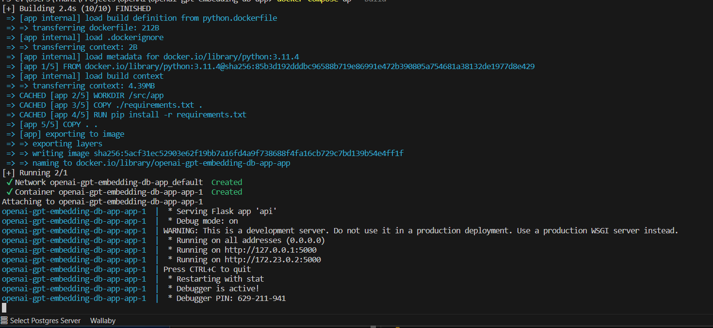
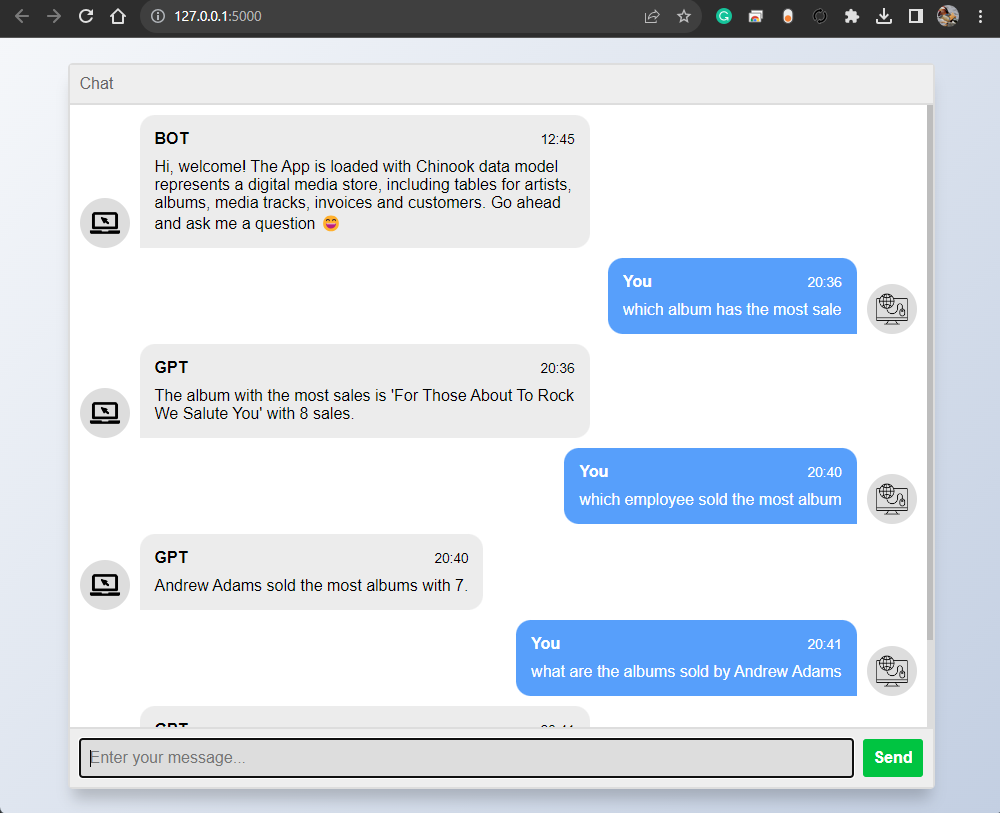
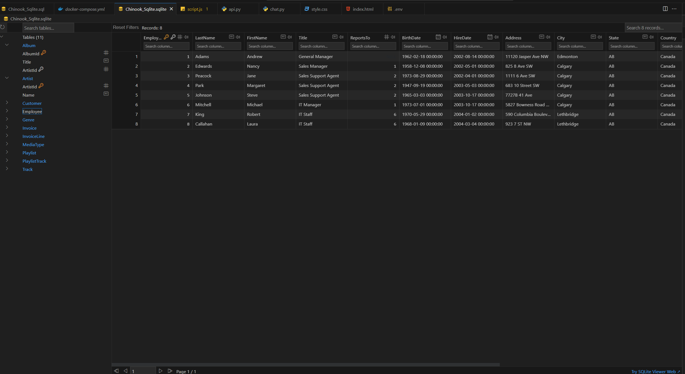

# openai-gpt-embedding-db-app
Dummy chatgpt bot integrated with personal database. 

## Get started
- Install docker and docker compose
- Register an OpenAI account, create a API Key and add that key to the .env file
- Run the command `docker-compose up --build` , one you see the console stop generating new logs and you see the url: `http://127.0.0.1:5000/` then the app is ready.

- Open web browser and visit ethe url `http://127.0.0.1:5000/`

- To view the database, you will need to use `DB Browser for SQLite`, or install the vscode extension.

## files
- api.py - the flask app that severs the chat box UI
- chat.py - the llms setup and chat function
- .env - where the API Key should be placed